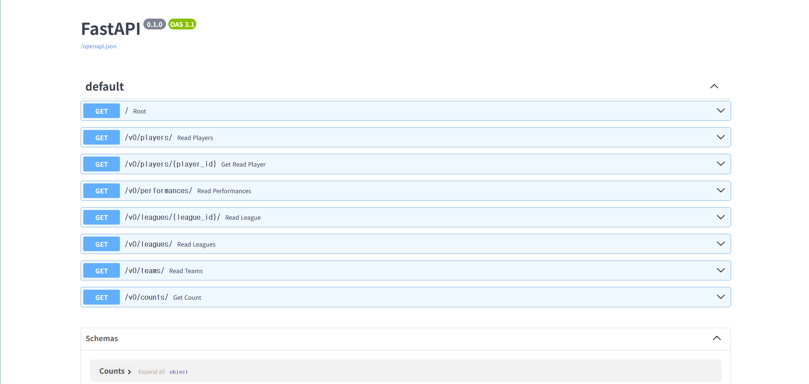
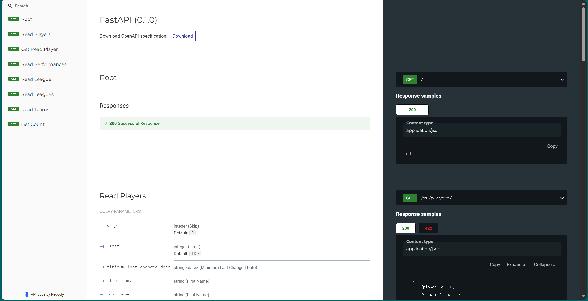
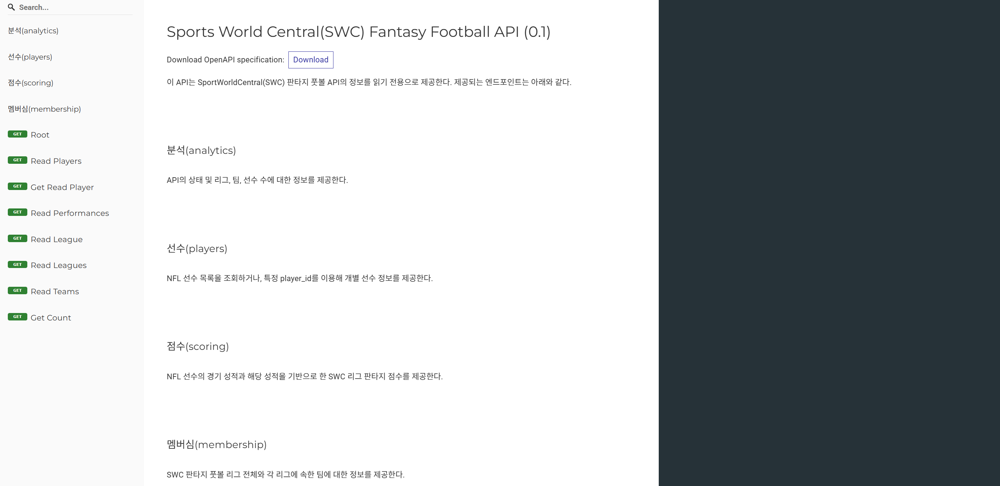
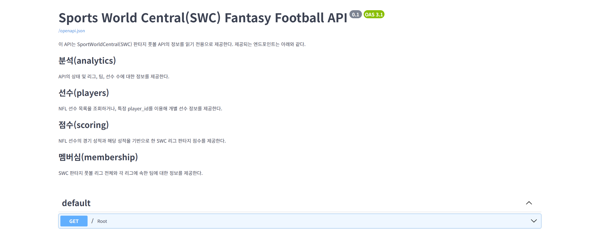
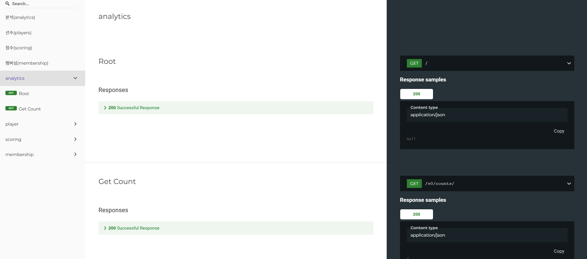
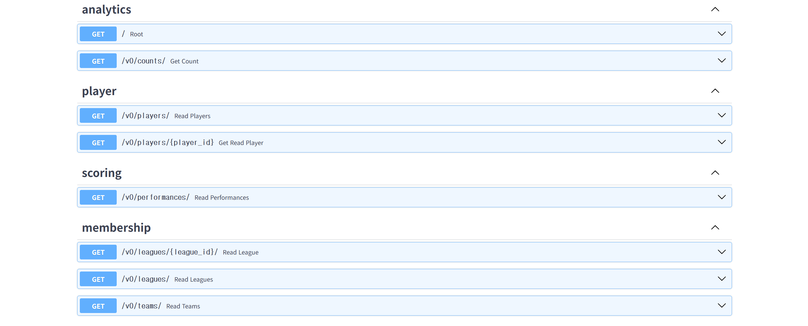
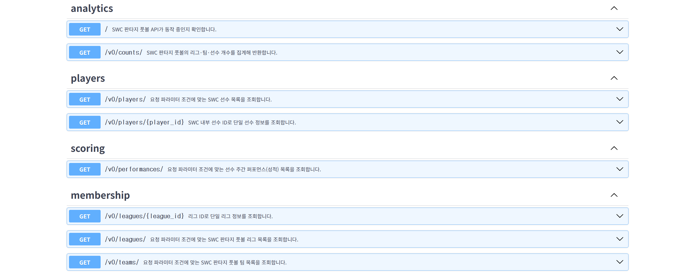
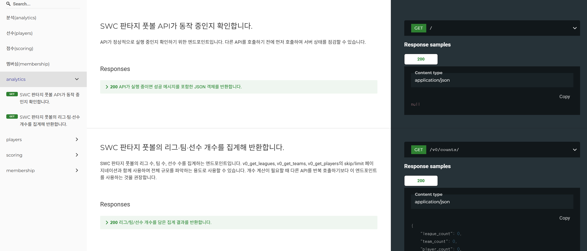
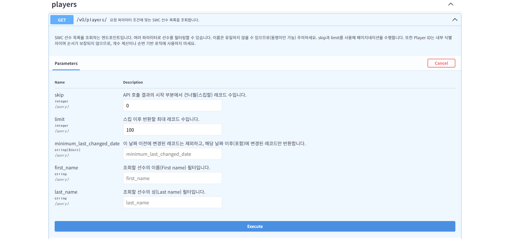
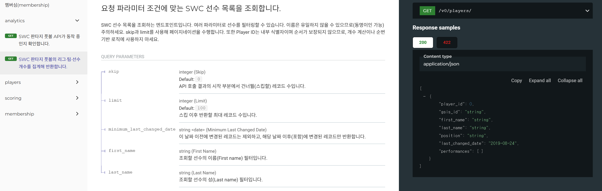

# 03. API Documentation

API의 중요한 역할 중 하나는 잠재적 사용자에게 신뢰를 주는 것이다. 
사용자들이 API를 반복적으로 호출하려면 이를 코드로 통합해야 하며, 이는 곧 사용자의 시스템이 API를
주기적으로 호출하도록 구현하는 것을 의미한다.

API는 결국 반복적으로, 자동으로 호출되기에 문서를 통해 신뢰할 수 있는 계약(constract)임을 명확히 보여주어야 한다.
사용자들은 반복적인 API 사용을 고려할 떄 **이 API를 신뢰할 수 있을지**에 대해 고민한다. 만약 이러한 신뢰를 주지 못한다면,
잠재적 사용자들은 API 사용을 포기하고 다른 대안을 찾을 것이다.

---

## 좋은 API 문서 만들기

API를 처음 접한 사람에게 필요한 것은 복잡한 기술 설명이 아니다. 
이 도구가 무엇을 위해 만들어졌고, 어떻게 사용할 수 있는지를 알려 주는 친절한 안내가 먼져다.

따라서 새로운 API 문서를 작성할 때는 **핵심 기능**부터 시작하는 것이 좋다. 
이러한 정보는 API 사용에 꼭 필요한 기반을 형성하며, 시간이 지나 API가 안정화됨에 따라 문서 또한 점진적으로 확장될 수 있다. 
이후에는 개발 경험과 생산성을 높이기 위한 **추가 기능**을 보완함으로써, 경쟁 API와 차별화된 강점을 만들어 갈 수 있다.


## 핵심 기능

사용자가 API를 처음 마주할 때 가장 먼저 찾는 것은 복잡한 코드보다는 API 주소, 인증 방식, 테스트 방법 등 사용자가 API를 이해하고 제대로 활용하기 위해 반드시 필요한 기본적인 정보들이다. 
이러한 요소가 빠지면 많은 사용자가 API의 신뢰성과 실용성에 의문을 품고 다른 대안을 찾게 된다.

API 문서에서 말하는 핵심 기능이란, 외부 개발자가 다음을 할 수 있게 만드는 정보이다.

- API를 이해한다. (무엇을 해결하는지)
- API를 성공적으로 호출한다. (인증·요청 형식)
- 응답을 코드로 처리한다. (스키마·에러 규약)
- 프로덕션에서 안전하게 운영한다. (제한·버전·변경 정책)

핵심 기능이 먼져 필요한 이유는 간단하다.
추가 기능은 핵심 계약이 명확해야만 의미가 있기 때문이다.
계약이 불명확하면, 추가 기능은 오히려 혼란을 키운다.

### API 문서의 핵심 기능 구성

1. 시작하기 (getting started, 온보딩의 최소 단위)
API의 목적과 사용 방법을 소개하는 개요 역할을 한다. API의 주소, 보안 요구 사항, 사용자 ID, 인증키 발급 절차 등을 안내해, 사용자가 API를 원활하게 시작하는 데 필요한 정보를 명확히 제공한다.

2. 엔드포인트 정의/명세 (Endpoint definitions)
각 엔드포인트는 API 사용자에게 제공되는 리소스를 설명하며, 요청 방식, 응답 형식, 발생 가능한 오류 정보를 포함한다. 엔드포인트는 API 호출 시 사용되는 전체 주소와 리소스 이름을 의미한다.

3. 오류 규약 및 운영 동작 (예측 가능한 실패 처리)
오류 응답 포맷과 에러 코드 체계를 정의하고, 재시도 가능 조건, 타임아웃 권장, rate limit(쿼터/제한) 및 제한 초과 시 대응 방식 등을 명시한다.
이를 통해 자동화된 시스템에서도 안정적으로 예외 처리가 가능해진다.

4. 버전·호환성·변경(폐기) 정책 (장기 통합 보장)
버전 표기 방식, 하위 호환성 원칙, breaking change 기준, deprecation 절차를 제공하여 시간이 지나도 통합 코드가 예측 가능하게 유지되도록 한다.

5. OAS/OpenAPI (기계 판독 가능한 계약)
사람이 읽는 문서와 별개로, 도구가 API 계약을 정확히 해석하도록 한다.
위 계약을 JSON/YAML 기반의 OpenAPI 명세로 제공하여 문서 자동 생성, 검증, Mock, SDK 등 도구 기반 통합을 가능하게 하고 문서-구현 간 불일치를 줄인다.


### API 문서의 추가 기능 구성

API 문서에서 **추가 기능**이란 핵심 기능(엔드포인트 명세, 오류 규약, 버전 정책 등)이 이미 갖춰졌다는 전제 하에, 외부 개발자가 API를 더 빠르고 쉽게 학습·통합·운영할 수 있도록 지원하는 요소를 말한다. 
추가 기능은 없으면 못 쓰는 정보가 아닌 개발 경험과 채택률을 높이는 장치에 가깝다.

1. 샘플 코드 및 예제 프로젝트
대표 사용 시나리오를 제공하여 구현 방향을 빠르게 잡게 하고, 올바른 요청/응답 처리, 에러 처리 패턴을 참고할 수 있게 한다.

2. 대화형 문서 (API Explorer/Try-it-out)
대화형 문서를 통해 사용자는 개발 환경에서 직접 샘플 API 호출을 실행해 보며, API의 동작을 확인할 수 있다.
FastAPI 프로젝트에서는 Swagger UI를 활용해 이러한 대화형 문서를 자동으로 생성할 수 있으며, 이를 통해 사용자가 실시간으로 API를 시험해 볼 수 있는 직관적인 인터페이스를 제공한다.

3. SKD 및 클라이언트 라이브러리
API 제공자가 주요 프로그래밍 언어로 된 SDK를 제공하면, 사용자들은 API를 더 쉽게 활용할 수 있다.
SDK는 과도한 요청이나 오용을 방지하는 데에도 도움이 되며, 특히 데이터 사이언티스트와 같은 기술 중심 사용자들에게는 진입 장벽을 낮추고 사용성을 개선하는 효과가 크다.

4. 샌드박스/테스트 환경
대화형 문서보다 한 단계 진화한 샌드박스 환경에서는 개발자가 여러 개의 API 호출을 순차적으로 수행하고, 상태를 유지한 채 그 결과를 확인할 수 있다.
예를 들어, 첫번째 호출로 주문을 하고, 이어서 두 번째 호출로 해당 주문 결과를 조회하는 방식이다. 이 환경은 실제 서비스와 유사한 조건에서 테스트해볼 수 있어, 복잡한 API 흐름을 검증하는 데 유리한다.

5. 기타 기능
API 제공자는 개발자의 편의를 높이기 위해 다양한 부가 기능을 함께 제공할 수 있다.
최근에는 Postman API 테스트 도구에서 실행할 수 있는 Postman 컬렉션이 인기를 끌고 있다. 
이 컬렉션은 샘플 요청과 테스트 사례를 포함하고 있어, 사용자는 API를 보다 쉽게 시도하고 이해할 수 있다.

6. 피드백 채널 
사용자가 API를 활용하는 과정에서 질문이나 문제를 전달할 수 있는 소통 창구는 매우 중요하다. 일반적으로 지원용 이메일 주소, 웹사이트 문의 양식, GitHub 이슈 트래커 같은 방식이 널리 사용된다. 
이러한 피드백 채널은 단순한 소통 수단을 넘어 사용자에게 신뢰를 주고, API 운영이 실제로 잘 유지되고 있다는 인상을 심어주는 중요한 역할을 한다.

---

02에서는 우선순위가 높은 사용자 요구를 충족시키기 위해 주요 엔드포인트를 포함한 API를 구축했다.
03에서는 FastAPI가 자동으로 생성해주는 문서를 살펴보고, 그 품질을 높이기 위한 코드 개선 작업을 진행한다.

이떄 **FastAPI가 자동으로 생성해 주는 문서**는 우리가 흔히 말하는 **완성형 API 문서 (사용자에게 제공되는)**라기보다, API 계약을 자동으로 드러낸 레퍼런스 문서에 가깝다.

FastAPI의 자동 문서는 서버 실행 시 별도 파일 생성 없이 기본 엔드포인트(`/docs`, `/redoc`, `/openapi.json`)로 제공되며, 서버 실행 방식은 `fastapi dev`(개발) 또는 `fastapi run`(운영)으로 구분된다. 두 방식 모두(문서 엔드포인트를 비활성화하지 않는 한) FastAPI 자동 생성 문서를 제공할 수 있다.
문서의 구체적 내용은 실행 모드 자체보다는 애플리케이션 코드와 설정에 의해 결정되므로, 동일한 코드와 설정으로 실행할 경우 동일하다.

### FastAPI 자동 생성 문서

1. FastAPI 자동 생성 문서의 구성 요소와 기본 URL

**OpenAPI 명세 (JSON) - 원천 계약서(기계 판독 명세, OAS 형식의 API 명세 파일)**
- 기본적으로 `/openapi.json`에서 OpenAPI 스키마가 제공된다. 
- 이 파일이 계약서 원천이고, Swagger UI/ReDoc은 이 JSON을 읽어 화면을 구성한다.
- SDK 생성, Mock 서버, 계약 기반 테스트 등 자동화 파이프라인의 입력으로 사용된다.

**Swagger UI (대화형 문서) - Swagger UI**
- 기본적으로 `/docs`에서 제공된다.
- 브라우저에서 엔드포인트를 펼쳐보고, 요청 값을 넣어 직접 호출(try/test)하는 대화형 경험이 핵심이다.
- 엔드포인트와 스키마 자체는 `/openapi.json`에서 온다.

**ReDoc (가독성 중심 문서) - 읽기 좋은 레퍼런스 문서**
- 기본적으로 `/redoc`에서 제공된다.
- Swagger UI보다 읽기 좋은 레퍼런스에 초점을 두 대체 UI이다.
- 문서 구조가 더 문서답게 정돈되어 보이는 편이라서 외부에 공개할 때나 팀 내부 표준 문서 형태로 제공할 때 사용된다.

2. FastAPI 자동 생성 문서의 엔드포인트

위의 세 가지 엔드포인트(`/docs`, `/redoc`, `/openapi.json`)는 핵심 내용이 동일한 하나의 원천을 공유한다.
정확히는 `/openapi.json`이 원천이고 나머지는 그 원천을 서로 다른 방식으로 보여주는 화면이다.
따라서 세 가지 엔드포인트의 근원적인 내용은 동일하고 표현 방식과 상호작용만 다를 뿐이다.

FastAPI 자동 생성 문서는 서버가 실행되면 자동으로 서비스하는 체계이다.
핵심 메커니즘은 아래의 흐름이다.
- `fastapi dev main.py` 또는 `fastapi run main.py`로 서버 실행
- 앱이 import되면서 라우트가 등록됨(`@app.get`, `@router.post` 등)
- FastAPI가 라우트/타입 힌트/Pydantic 모델 정보를 기반으로 OpenAPI 스키마를 구성
- 서버 실행 시 `/openapi.json`, `/docs`, `/redoc` 경로가 (기본 설정이라면) 동시에 등록되어 함께 제공된다.
- `/docs`, `/redoc`은 문서 UI(HTML)를 반환하며, 브라우저에서 해당 UI가 OpenAPI 스키마(`/openapi.json`)을 요청해 읽은 뒤 화면을 렌더링한다.
> 디스크에 파일이 생성되는 것이 아닌 HTTP 요청에 대한 응답으로 JSON/HTML을 반환하는 형태이다.

3. FastAPI 자동 생성 문서에 포함되는 내용

1. API 메타정보 (문서 상단 정보)
- API 제목, 버전, 설명
- 서비스 소개 문구, 연락처/라이선스 같은 부가 정보

2. 엔드포인트 (경로 + 메서드)
각 API에 대해
- 경로(`/item/{id}`), 메서드(`GET/POST/...`)
- 요약, 상세 설명, 태그로 그룹화

3. 요청 명세
- Path 파라미터: `{id}` 같은 경로 변수
- Query 파라미터: `?path=1&size=20`같은 것들
- Header/Cookie 파라미터 (필요 시)
- Request Body (Json 등): Pydantic 모델 기반 스키마

4. 응답 명세
- 상태 코드별 응답(200/201/400/401/404/422/500 등)
- 응답 바디 스키마 (성공 응답 모델, 오류 응답 모델)
- 응답 예시를 넣으면 문서 신뢰도 상승

5. 인증/보안 명세
- API Key, OAuth2 등 인증 방식이 OpenAPI 스키마에 표현됨
- `/docs`에서는 Authorize 같은 UI로 테스트 가능

---

## 참고

### 현재 가상환경의 파이썬 버전 확인하는 방법

`python -m pip --version`

위의 명령어를 입력하면 확인 가능하다. 결과는 pip의 경로와 해당 가상환경이 사용하는 파이썬의 버전을 확인할 수 있다.

`pip 25.3 from {가상환경 경로}\Lib\site-packages\pip (python 3.12)`

### `fastapi dev`와 `fastapi run`

공통점: 둘 다 서버 실행 명령이다.
- `fastapi dev main.py`와 `fastapi run main.py`는 모두 FastAPI 애플리케이션을 실행해서 HTTP 서버를 띄우는 명령이다.
- 서버가 뜨면(문서 엔드포인트를 비활성화하지 않은 한) `/docs`, `/redoc`, `/openapi.json` 같은 자동 문서 엔드포인트가 함께 제공된다.
> 즉, 문서가 dev에서만 생기고 run에서는 안 생기는 구조가 아니다.

**`fastapi dev`: 개발(Development) 모드 실행**

목적: 개발 중에 빠르게 반복 작업(코드 수정 -> 즉시 반영)을 하기 위한 실행 방식

특징(대표)
- 자동 리로드(reload)가 기본적으로 활성화되어, 파일을 수정하고 저장하면 서버를 수동으로 재시작하지 않아도 자동으로 재시작되어 반영된다.
- 로컬 개발에 최적화된 기본값(호스트/로그 등)을 사용한다.
- 터미널 로그에 `Documentation at .../docs`처럼 문서 URL을 안내해 주는 등 개발자 친화적 출력이 나온다.

언제 사용?
- 로컬에서 기능 개발/디버깅/테스트할 때
- 엔드포인트 추가/모델 변경 등으로 `/docs`가 바뀌는지 빠르게 확인할 떄


**`fastapi run`: 운영(Production) 기본값 실행

목적: 운영 환경에 가까운 기본값으로 안정적으로 서버를 실행하는 방식

특징(대표)
- 일반적으로 자동 리로드가 기본 비활성화되어 있다.(운영에서 코드 변경 감지 재시작은 보통 사용하지 않는다.)
-외부 접근(예: 컨테이너/서버 배포)을 고려한 기본 옵션을 사용하는 경우가 많다.
- 개발 편의보다 운영 적합성에 맞춘 실행에 가깝다.

언제 사용?
- 실제 배포 환경에서 실행할 때(서버/컨테이너)
- 개발 중이라도 운영과 유사한 조건에서 동작을 확인하고 싶을 때

핵심 차이 요약
- `dev`: 개발 반복 작업을 위한 기본값(리로드 중심)
- `run`: 운영에 가까운 기본값(안정 실행 중심)
- 로그/개발 편의 출력: `dev`는 개발자 친화적 로그를 더 적극적으로 노출하고 `run`은 운영 실행에 필요한 형태로 더 절제된 편이다.


### 문서화 옵션 1: Swagger UI

Swagger UI는 API를 테스트할 수 있는 대화형 기능을 제공하기에 Redoc 문서보다 더 자세히 설명한다.
브라우저의 기본 URL 끝에 /docs를 붙여 접속하면 된다. (`localhost:{사용한 포트 번호}/docs`)
이 URL로 접속하면 아래와 같이 Swagger UI의 초기 화면이 표시된다.



Swagger UI의 문서 화면은 요청 매개 변수와 응답 형태를 명확하게 보여 줌으로써 개발자나 사용자는 모두 API 동작을 쉽게 이해하고 검증할 수 있다.


### 문서화 옵션 2: Redoc

FastAPI는 Swagger UI 외에도 또 하나의 문서화 도구인 Redoc을 기본으로 제공한다.
Redoc은 Redocly가 주도하는 오픈 소스 API 문서화 도구로, 다양한 API 문서를 정돈된 형식으로 시각화할 수 있다.

Redoc으로 작성된 API 문서를 확인하려면 브라우저의 기본 URL 뒤에 /redoc을 덧붙이면 된다. (`localhost:{사용한 포트 번호}/redoc)`
이 URL로 접속하면 아래와 같이 Redoc 문서의 초기 화면이 표시된다.



위 사진에서 볼 수 있듯이 Redoc 문서는 3개의 열로 구성되어 있다. 
왼쪽 탐색 바에는 검색 기능과 함께 API 엔드포인트가 나열되어 있으며, 가운데에는 각 엔드포인트에 대한 매개 변수, 응답, 오류 코드 등과 같은 주요 정보가 정리되어 있다.
오른쪽에는 200(성공)과 422(오류) 응답에 대한 JSON 응답 본문이 표시된다.

Redoc 문서의 내용은 Swagger UI와 매우 비슷하다. 이는 두 도구가 동일한 OAS 파일을 기반으로 문서를 자동 생성하기 떄문이다.
다만 Redoc은 Swagger UI와 달리 API 요청을 문서 내에서 직접 실행할 수 있는 대화형 기능은 제공하지 않는다.


### OAS 파일

앞서 살펴본 Swagger UI와 Redoc 기반의 문서 페이지는 매우 인상적이지만, OAS 파일 없이는 이 모든 문서를 만들 수 없다.
이는 단순한 비유가 아니라 실제로 FastAPI와 Pydantic이 `/openapi.json` 경로에서 OAS 파일을 자동으로 생성하고, Swagger UI와 Redoc은 이 파일을 토대로 문서를 구성한다.
그러나 OAS 파일의 역할은 단순히 문서를 만들기 위한 자료에 그치지 않는다. 이 파일은 외부 도구들이 API와 연동하거나 상호 작용할 수 있도록 해주는 강력한 API 정의 표준이다.
OpenAPI.Tools(`https://openapi.tools/`) 웹사이트에는 코드 생성기, 데이터 유효성 검사기, SDK 생성기, 모의 서버 등 OAS 파일을 기반으로 작동하는 많은 도구가 있다.
이처럼 OAS는 사실상 API 정의 표준으로 자리잡았으며, 다양한 자동화 및 연동 도구의 핵심이 되고 있다.

> OAS 파일은 하나의 API를 정의하지만, 최근 OpenAPI Initiative에서는 2025년 1월에 일련의 API 호출 흐름(Call Workflow)을 정의하는 새로운 명세인 Arazzo(v1.0.1)를 발표했다. 이 명세는 LLM을 기반으로 하는 생성형 AI 애플리케이션을 위한 시나리오를 제공한다.


---

## 사용법

터미널에 아래의 명령어를 입력하면 서버가 실행되고 3개의 문서/명세 엔드포인트가 활성화된다.

`fastapi dev main.py {사용할 포트 번호}`

성공 시 아래와 같은 출력이 나온다.

```
   FastAPI   Starting development server 🚀
 
             Searching for package file structure from directories with __init__.py files
             Importing from C:\Users\HeonSu\personal\python\HandsON\API_Devlopment\03_api_documentation\src
 
    module   🐍 main.py
 
      code   Importing the FastAPI app object from the module with the following code:

             from main import app

       app   Using import string: main:app

    server   Server started at http://127.0.0.1:8080
    server   Documentation at http://127.0.0.1:8080/docs

       tip   Running in development mode, for production use: fastapi run

             Logs:

      INFO   Will watch for changes in these directories: ['C:\\Users\\HeonSu\\personal\\python\\HandsON\\API_Devlopment\\03_api_documentation\\src']
      INFO   Uvicorn running on http://127.0.0.1:8080 (Press CTRL+C to quit)
      INFO   Started reloader process [17744] using WatchFiles
      INFO   Started server process [11768]
      INFO   Waiting for application startup.
      INFO   Application startup complete.
```

FastAPI는 기본적으로 OAS 파일을 자동 생성하는 기능을 제공하며, 이 기본 기능만으로도 사당히 강력한 문서를 만들 수 있다. 그러나 main.py 파일의 FastAPI 코드를 직접 수정하면,
OAS 파일을 더욱 풍부하고 실용적으로 개선할 수 있다.
특히 API 사용자 이해를 돕기 위해 설명, 태그, 매개 변수 주석 등을 명확히 추가함으로써 API 문서의 완성도를 한층 높일 수 있다.
FastAPI 코드에 메타데이터와 스키마 설명을 보강하면 /docs, /redoc의 자동 생성 레퍼런스 문서 품질이 향상되며, 이는 사용자에게 제공 가능한 API 레퍼런스로 활용할 수 있다. 다만 완성형 API 문서는 레퍼런스 외에 온보딩, 운영 가이드, 버전/변경 정책 등 가이드성 문서를 포함하므로, 일반적으로는 자동 생성 레퍼런스와 별도 가이드 문서를 결합해 제공한다.

아래의 표는 OAS 파일을 개선하기 위해 main.py 파일을 수정할 내용을 정리한 것이다.
각 개선 항목은 Swagger UI와 같은 API 문서화 도구에서 엔드포인트를 그룹으로 묶거나, 사용자에게 명확한 사용법을 전달하는 데 도움을 주며, 생산 환경에 배포되는 API에서는 문서의 신뢰성과 사용성을 높이는 데 중요한 역할을 한다.

| 개선 사항 | main.py 수정 내용 | 영향을 받은 OAS 항목 |
| --- | --- | --- |
| API 제목, 버전, 설명 추가 | FastAPI() 생성자에 항목 추가 | info |
| 엔드포인트 요약 추가 | path 함수 데코레이터에 summary 매개 변수 추가 | paths |
| 엔드포인트 상세 설명 추가 | path 함수 데코레이터에 description 매개 변수 추가 | paths |
| Swagger UI에서 엔드포인트를 그룹으로 묶기 위한 태그 추가 | path 함수 데코레이터에 tag 매개 변수 추가 | paths |
| 고유 엔드포인트 작업 ID 추가 | 기본 작업 ID 수정 | paths |
| 쿼리 매개 변수에 설명 추가 | FastAPI 함수의 매개 변수 업데이트 | parameters |

---

### OAS info 객체에 세부 정보 추가하기

OAS 파일의 info 항목은 전체 API에 대한 기본 정보를 제공한다. 하지만 기본 설정 상태에서는 그 내용이 매우 일반적이기에 API의 목적과 기능을 사용자에게 명확히 전달하려면 이를 직접 보완해야 한다.
이를 위해 **`FastAPI()` 생성자에 설명, 제목, 버전 등의 세부 정보를 추가할 수 있다.**

main.py 파일의 생성자 코드를 아래와 같이 작성하여 info 객체에 세부 정보를 추가할 수 있다.

```
api_description = """
이 API는 SportWorldCentral(SWC) 판타지 풋볼 API의 정보를 읽기 전용으로 제공한다.
제공되는 엔드포인트는 아래와 같다.

## 분석(analytics)
API의 상태 및 리그, 팀, 선수 수에 대한 정보를 제공한다.

## 선수(players)
NFL 선수 목록을 조회하거나, 특정 player_id를 이용해 개별 선수 정보를 제공한다.

## 점수(scoring)
NFL 선수의 경기 성적과 해당 성적을 기반으로 한 SWC 리그 판타지 점수를 제공한다.

## 멤버심(membership)
SWC 판타지 풋볼 리그 전체와 각 리그에 속한 팀에 대한 정보를 제공한다.
"""

# OpenAPI 명세에 추가 세부 정보가 추가된 FastAPI 생성자
app = FastAPI(
    description=api_description,
    title="Sports World Central(SWC) Fantasy Football API",
    version="0.1",
)
```

이렇게 하면 아래와 같이 Swagger UI와 Redoc 문서의 info가 변경되었음을 확인할 수 있다.





---

### 경로 분류를 위한 태그 추가하기

OAS 파일의 path 객체를 설명하는 각 개별 엔드포인트를 수정하자.
첫 번쨰로 변경할 내용은 태그를 추가하는 것이다. 
태그로 다양한 용도로 활용할 수 있는 범용 속성으로 여기서는 Swagger UI가 API 경로들을 카테고리별로 묶기 위해 사용한다.
API에 엔드포인트가 수십 개 이상 존재할 경우, 태그는 사용자 입장에서 API의 구조를 이해하고 탐색하는 데 매우 유용한 정보이다.

이 기능을 적용하려면 각 경로 함수의 데코레이터 팩토리에 tags 매개 변수를 추가해야 한다.
예를 들어, main.py 에 정의된 `/v0/players/{player_id}` 엔드포인트에 대한 
```
@app.get(
    "/v0/players/{player_id}",
    response_model=schemas.Player
    )
```

데코레이터 팩토리를 아래와 같이 수정하면 된다.

```
@app.get(
    "/v0/players/{player_id}",
    response_model=schemas.Player,
    tags=['player']
    )
```

결과적으로 태그를 추가하는 것은 **데코레이터 팩토리** 호출에 인자를 추가하는 것이다.

위와 같은 방식으로 하나의 엔드포인트에 대한 태그룰 추가한 후, main.py에 정의된 나머지 엔드포인트에도 
아래의 표를 참조해 태그를 부여한다.

| 엔드포인트 | 태그 | 엔드포인트 | 태그 |
| --- | --- | --- | --- |
| / | analytics | /v0/leagues/ | membership |
| /v0/players/ | player | /v0/leagues/{league_id}/ | membership |
| /v0/players/{player_id}/ | player | /v0/teams/ | membership |
| /v0/performances/ | scoring | /v0/counts/ | analytics |

태그를 추가하면 Swagger UI와 Redoc 문서는 아래와 같이 변경된다.





---

### 개별 엔드포인트에 세부 정보 추가하기

OAS 파일의 paths항목에 정의된 개별 엔드포인트에 더 많은 정보를 추가해 API 문서를 보다 풍부하게 만들 수 있다.
이를 위해 main.py 파일의 각 경로 함수 데코레이터 팩토리를 수정한다.

주요 변경 사항은 아래와 같다.

- 요약 추가: 해당 엔드포인트에 대한 간단한 설명을 추가해 Swagger UI의 작업 제목에 표시되도록 한다.

- 설명 추가: 엔드포인트에 대한 추가적인 상세 설명을 제공해 Swagger UI에서 작업 제목 아래에 표시되도록 한다.

- 200 응답에 대한 설명 추가: HTTP 200 응답 시 나타나는 기본 문구인 '성공적인 응답'을 보다 명확하고 직관적인 사용자 정의 설명으로 대체한다.

- operationID 수정: 자동 생성되는 식별자 대신 도구나 생성형 AI가 해석하기 쉽도록 표준화된 식별자 값으로 지정한다.

main.py에 정의된 `/v0/players/{player_id}}` 엔드포인트에 대한 

```
@app.get(
    "/v0/players/",
    response_model=list[schemas.Player],
    tags=["player"]
    )
```

데코레이터 팩토리를 아래와 같이 수정하자.

```
@app.get(
    "/v0/players/",
    response_model=list[schemas.Player],
    summary="SWC 선수 ID를 사용해 단일 선수 정보를 가져옵니다.",
    description="다른 API 호출(v0_get_players 등)에서 얻은 SWC Player ID를 이용해 해당 선수를 조회할 수 있습니다.",
    response_description="선택한 NFL 선수 정보입니다.",
    operation_id="v0_get_players_by_player_id",
    tags=["player"]
    )
```

이렇게 수정된 내용은 아래와 같은 개선점을 반영한다.

- 엔드포인트에 대한 간결하고 명확한 요약을 제공한다.
- 개발자와 AI가 이해하기 쉬운 상세 설명을 포함한다.
- HTTP 200 응답에 대한 설명을 사용자 관점에서 직관적으로 재작성한다.
- 명확한 사용자 지정 작업 ID 부여로 자동 생성된 작업 ID를 대체한다.

이것이 반영된 결과는 아래와 같다.





---

### 쿼리 매개 변수 설명 추가하기

생성형 AI가 API를 더 쉽게 이해하고 활용할 수 있도록 API 호출에 사용되는 쿼리 매개 변수에 설명을 추가하는 것이 권장된다.
이를 위해 각 매개 변수의 기본값을 Query() 함수와 함꼐 정의하고, 해당 매개 변수가 어떤 역할을 하는지 명확하게 기술해야 한다.

예를 들어 앞에서 데코레이터를 수정했던 read_players 함수는 아래와 같이 개선할 수 있다.

```
def read_players(
    skip: int = Query(
        0, description="API 호출 결과의 시작 부분에서 건너뛸(스킵할) 레코드 수입니다."
    ),
    limit: int = Query(
        100, description="스킵 이후 반환할 최대 레코드 수입니다."
    ),
    minimum_last_changed_date: date = Query(
        None,
        description="이 날짜 이전에 변경된 레코드는 제외하고, 해당 날짜 이후(포함)에 변경된 레코드만 반환합니다.",
    ),
    first_name: str = Query(
        None, description="조회할 선수의 이름(First name) 필터입니다."
    ),
    last_name: str = Query(
        None, description="조회할 선수의 성(Last name) 필터입니다."
    ),
    db: Session = Depends(get_db),
):
```

이와 같이 각 매개변수에 설명을 추가해 문서를 더 친절하게 만들면, AI 모델이나 개발자들이 API의 동작을 보다 정확히 이해할 수 있다.

나머지 다른 모든 API 엔드포인트에서도 동일한 방식으로 쿼리 매개 변수에 설명을 추가하자.

적용된 결과는 아래와 같다.





---
